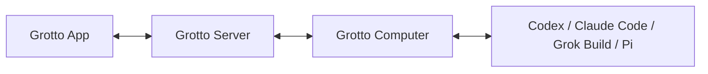

# Architecture overview

Grotto has three supported first-party surfaces:

| Surface | Owns |
| --- | --- |
| Grotto Server | Identity, authorization, Servers, members, Chats, Messages, Tasks, Reminders, attachments, connections, desired Agent configuration, and reported execution summaries. |
| Grotto App | React presentation in browsers and Electron, local settings, cache, optimistic UI, and direct Server interaction. |
| Grotto Computer | Server attachments on a physical machine, Agent workspaces, queues, runtime/model discovery, effective execution state, and Agent turns. |
| `@tavern/api` | Typed contracts shared across those boundaries and the Agent CLI. |

The App never connects directly to Computer. Server sends typed delivery and control messages to
the Agent's assigned Computer. Computer reports availability, state, progress, and bounded turn
summaries back to Server. Full prompts, transcripts, tool traces, provider credentials, and Agent
workspace files remain on the machine unless a specific product contract says otherwise.
Normalized per-turn token counters are part of the bounded summary; they do not
carry prompt or transcript content.

“Runtime” means a Computer-local execution runtime such as Codex, Claude Code, Grok Build, or Pi. There is no
standalone Grotto Runtime service, release, compatibility floor, updater, or deployment surface.

See [ADR 0019](../adr/0019-servers-own-collaboration-computers-own-execution.md) for the ownership
decision and [ADR 0020](../adr/0020-computer-ships-as-a-signed-standalone-release.md) for Computer
distribution.
